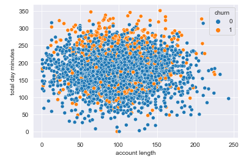
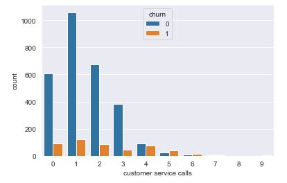
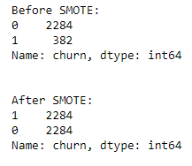

# SyriaTel Customer Churn

## Contributors
- Eric Cusick
- Trevor Mott

## Buisness Case
The SyriaTel, a telecommunications company has enlisted the service of a data scientist for help. SyriaTel wants to know when customer are going to stop doing business with them. It is in their interest to be able to retain customers to continue to make profits.

Given the 'customer_churn.csv' file the data scientist is expected to:
- Build an accurate model
- Report features that may be an indicator that the customers will be more likely to leave
    
## Exploratory Data Analysis (EDA)
Throughout the EDA, we're taking a look at some features to see how the target (churn) interacts with other columns

In the scatterplot, it shoes the relationship between the account length and the total day minutes used by each customers. To see if the length of time or the amount of minutes used has an impacted on churn. It seems that the more minutes used, the higher the likelihood of the customers potentially leaving the comapany.

There is a trend showing in the countplot of customer service calls. Overtime if there is an increase number of service call the likelihood of the customer leaving increases. As seen in the graph eventually the churn starts over taking the customers who stay.

Here we see a potential problem for modeling. Out of over 3000 customers in this dataset, almost 500 of them has left the company. This signify a significant class imbalance, the first model preform on this dataset is Logistic Regression. It produced a high accuracy score, but a low recall score meaning the percentage of the class we're interested in were not well captured by the model. 

## Model Process for Random Forest

During the modeling process for Random Forest:
- I fitted SMOTE into the training data from the original train test split data to improve the class imbalance

- As well as took full advantage of the Grid Search to find the most optimal parameters for the Random Forest Classifier

Optimal Parameters for Random Forest Classifier:
- criterion : entropy
- max_depth : None
- min_samples_leaf : 2
- min_samples_split : 5
- n_estimators : 100

## Final Random Forest Model

In the final model I took a close look at feature importances by sorting them by weights. The higher the feature's weight the more of an influence it has on the churn, or the more likely that the customers will leave. 

Also taking a look at the final metric score:

The metric score preform quite well, the recall score and the F1 score are up high and the accuracy score perform very well showing that it is a good model.

## Recommendations

After looking at the model, I would recommend:
- Increase the quality of customer services care to decrease the likelihood of being called multiple times
- Provide a decreasing or dicount charge rate after hitting a cap of 240 call minutes instead of a flat rate or increasing charge. 
- Give out some rewards or benefits for customers for their account length overtime to promote customer loyalty. 

SyriaTel communication company will be able to utilize this information to make decision that would best serve their interest in customer retention. 
